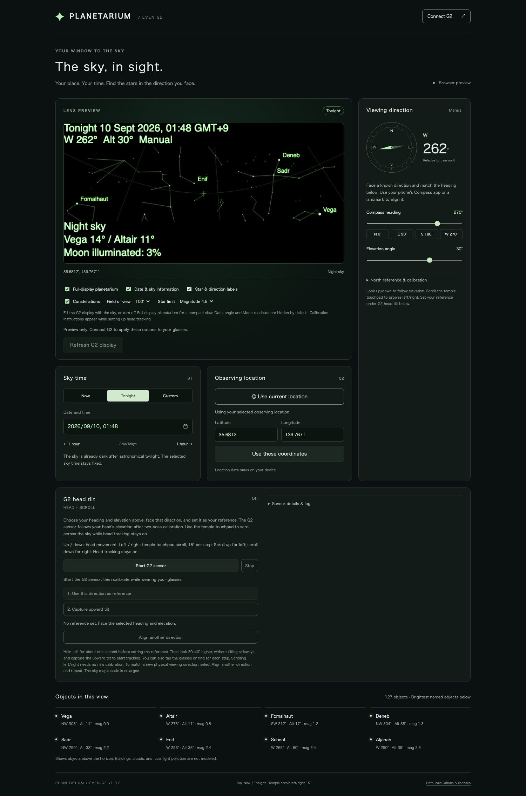
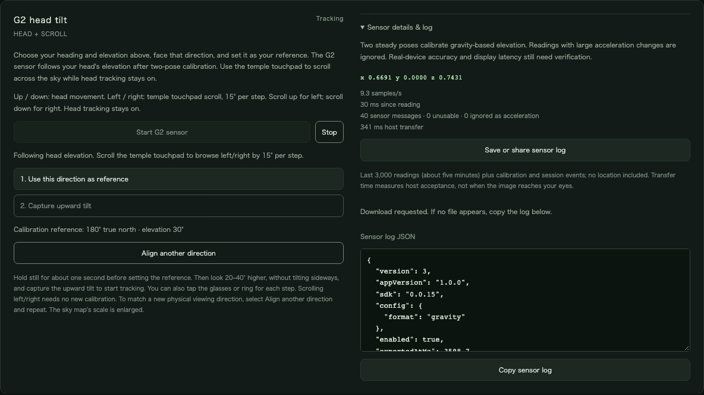

# G2 Planetarium

[](https://github.com/kuma0128/planetarium-even-g2/actions/workflows/planetarium.yml)

An open-source Even Hub app that puts a sky map on Even Realities G2. Choose your observing location and time, then set your viewing direction manually.

Set your viewing direction manually, then look up/down to follow head elevation and scroll the temple touchpad to browse left/right. A direction-reference button anchors a two-pose calibration.



*Web interface preview: Tonight in Tokyo, facing west.*

## Features

- **Four interface languages:** English (default), Japanese, Korean, and Simplified Chinese. Choose **Language** in the top bar; your choice is saved on this device when browser storage is available. Switching updates the interface, G2 captions, direction labels, and Sun/Moon/planet names without resetting the observing time, location, or head calibration. Star catalog proper names retain their international spelling. Dates still use your device's time zone; diagnostic JSON and source license documents remain in English.
- **Now, Tonight, or Custom:** follow the current sky or explore a selected date. Tonight chooses 30 minutes after astronomical dusk, or the current time if it is already dark, and explains polar-day fallbacks.
- **Your observing location:** use location permission or enter latitude and longitude. A reported GPS altitude outside −500 to 10,000 m is clamped instead of rejecting the fix. Date input and display use your **device's time zone**, including when you choose coordinates in another country.
- **An offline sky catalog:** 2,865 stars, constellation lines, the Moon, Sun, Mercury, Venus, Mars, Jupiter, and Saturn. Objects below the horizon are hidden.
- **Compass alignment:** face a known direction and enter its heading manually. Choose magnetic or true north, with magnetic declination calculated for your location and today's date.
- **Adjustable view:** change elevation, field of view, the star magnitude limit, and constellation lines. See the brightest named objects with their azimuth and altitude.
- **Full-display planetarium:** the sky fills the entire 576 × 288 display by default. Date, direction/elevation numbers, Moon readouts, and star/direction labels start hidden. Enable the information and label options independently, or turn off full-display mode for the compact sky map. Temporary head-calibration instructions still appear during setup.
- **G2 head tilt:** use **Use this direction as reference** to capture your forward view, then capture an upward tilt to start elevation tracking. **Align another direction** resets the reference without reconnecting the sensor. Pose capture averages steady readings and tolerates an isolated sensor glitch. Sensor readings, sample rate, unusable and ignored-acceleration counts, transfer timing, and a downloadable log with session events help with real-device verification.
- **Head + touchpad controls:** look up/down to follow elevation; scroll the temple touchpad to browse left/right by 15 degrees per step without stopping head tracking. Scroll up moves left (heading −15°); scroll down moves right (heading +15°). R1 ring scrolling works too. Tap switches Now / Tonight, and double-tap opens the exit dialog.

## Run the browser preview

Requires Node.js 22.18 or later and npm for the TypeScript app and Even Hub SDK. Python catalog maintenance uses [uv](https://docs.astral.sh/uv/); see [Data and licenses](#data-and-licenses).

```bash
git clone https://github.com/kuma0128/planetarium-even-g2.git
cd planetarium-even-g2
npm ci
npm run dev
```

Open <http://localhost:5173/>. The initial view is a clearly labeled **Tokyo demo**. Sending sky frames to G2 starts only after you choose an observing location.

1. Select **Use current location**, or enter coordinates and select **Use these coordinates**.
2. Choose **Now**, **Tonight**, or **Custom**.
3. Face a known direction and match **Compass heading** to it. Read the bearing in a separate Compass app or use a known landmark.
4. Under **North reference & calibration**, select **True north** if your compass already applies magnetic correction. Otherwise keep **Magnetic north**.
5. Set **Elevation angle**: 0 degrees is the horizon; 90 degrees is straight up.

Direction is controlled manually or with temple/ring scrolling on both iPhone and Android. This app does not request phone orientation permission. Use **G2 head tilt** below to set a direction reference and follow elevation. Changing your head's left/right direction is not detected; align the heading again after physically turning.

Browser location access normally requires HTTPS. G2 sensor access goes through the Even Hub SDK and does not need phone compass permission.

**If Lens Preview options seem unchanged:** the note under the preview explains whether a location, G2 connection, or north reference is missing. Options apply to both the preview and G2 once these are ready. **Refresh G2 display** is available while G2 is connected and resends every tile, including unchanged pixels, without resetting head calibration. Rendering has a timer fallback for hosts that suspend browser animation frames. The version at the bottom of the page identifies the installed build.

## Load on G2

Requires G2, the **Even app 2.2.10 or later**, and Even Hub developer access. The SDK version is pinned in `package.json`.

```bash
npm run pack
```

This creates `g2-planetarium.ehpk`, an Even Hub app package. Successful [GitHub Actions runs](https://github.com/kuma0128/planetarium-even-g2/actions/workflows/planetarium.yml) also provide it in the `g2-planetarium` artifact.

`npm run pack` adds `min_sdk_version` to a temporary copy of `app.json` from the pinned SDK dependency and passes that version to the CLI. Sensor logs use the same dependency version.

- **Local development:** follow the [official local-testing instructions](https://hub.evenrealities.com/docs/test/local-testing). Generate a development QR code with `npx evenhub qr --url http://YOUR_COMPUTER_IP:5173` and open it through the Even app's developer tools.
- **Package testing:** upload the `.ehpk` for Private Testing in the Even Hub developer portal, then launch it from the Even app. See the [official packaging guide](https://hub.evenrealities.com/docs/ship/packaging).

The app connects automatically when it detects the Even Hub bridge. Use **Connect G2** to retry. Creating the G2 display times out after six seconds and restores the connection controls.

The G2 page starts as an OS-rendered text message: *G2 Planetarium started. Please continue on your phone. Set your observing location to display the sky.* It stays on the glasses until you choose an observing location and is shown for at least 1.5 seconds. The first sky frame then rebuilds the page into the four image tiles.

Individual image transfers, the sky-page rebuild, and sensor start/stop operations also time out after six seconds: the session stops, the controls recover, and a message asks you to reconnect or reopen the app. Live sensor readings cannot leave calibration stuck behind a missing start acknowledgement.

If a previous image transfer, sensor command, page creation, or page rebuild is still waiting for the host, reconnect reports this after four seconds and restores the button. Native calls cannot be cancelled, so a retry waits for the original calls and sensor cleanup to settle before creating another page. Late results cannot restore the timed-out session or overwrite its recovery message. Retry after the connection recovers, or reopen the app if the host remains unresponsive.

A regular browser runs the preview. This repository does not include custom firmware, and the app has not been published to the public Even Hub store.

Image updates pause between G2 foreground exit and re-entry. Returning to the foreground resends the complete current view without reconnecting; head tracking requires calibration again. Transfers already waiting for the host at exit cannot be cancelled, but their late results do not close the resumed session.

Foreground, exit, and disconnect events are observed while the G2 page is being created too. A late creation response cannot revive a closed session or resume a page that is still in the background. Gestures take effect only after the page is ready and in the foreground.

Device-status events identify devices only by serial number. Once the G2 serial is known, other devices' disconnects are ignored. Until then, including when device lookup fails or returns another model, any disconnect ends the session to avoid missing a lost G2 link. A ring disconnect can therefore require **Connect G2** in this fallback state.

## Align a direction and follow G2 head tilt

The implementation uses stable gravity-like readings from the [official IMU API](https://hub.evenrealities.com/docs/build/device-apis#imu). Two poses recover elevation across sensor axes, signs, scale, and mounting angles. A first real-device log (app 0.1.5, SDK 0.0.15) showed a vector with magnitude close to 1 at about 10 readings per second, with occasional near-zero dropout frames and short acceleration spikes; calibration reached tracking. The SDK does not specify the axes' units or coordinate convention, and elevation accuracy against the optical display is **still unverified**.

1. Open the app through Even Hub, set your observing location, and wear the glasses.
2. Face a known direction. Set **Compass heading**, its north reference, and **Elevation angle** to match your view. For example, use 90° for east with the correct magnetic/true north reference, and 0° for the horizon. Start between −60° and 60° elevation.
3. Under **G2 head tilt**, select **Start G2 sensor**. Hold still for about one second, then select **1. Use this direction as reference**, or tap the glasses/ring. The captured heading and elevation appear under the buttons.
4. Look 20–40° higher without turning or tilting sideways. Hold still for about one second, then select **2. Capture upward tilt**, or tap again. Tracking starts after this second pose. During tracking, taps resume switching Now / Tonight.
5. Look up and down to follow elevation. Scroll the temple touchpad to browse left/right by 15° per step; scrolling does not stop the sensor or reset calibration. R1 ring scrolling also works. Sideways roll is compensated for elevation; the map itself does not rotate with your head.
6. To realign the map with a new physical viewing direction, select **Align another direction**, adjust the heading and elevation, and repeat the two captures. The sensor stays connected. **Stop** returns to manual elevation at the last displayed angle.

The reference button records the direction you supply; it does not measure north or enable left/right head tracking. Temple/ring scrolling changes the displayed heading and keeps it there until the next scroll or manual adjustment. Both scroll directions wrap across north (0°/360°). No recalibration is needed to browse the sky this way.

Samples whose magnitude differs from the calibrated gravity by more than 15% are ignored as possible acceleration and counted in the diagnostics. This cannot eliminate every movement artifact. Near-zero readings are dropout frames: they count as unusable and never enter calibration or tracking. Missing or unusable readings for 1.5 seconds freeze the last elevation and invalidate calibration; new readings alone never silently reactivate it. Disconnecting, leaving the **G2 foreground**, closing the page, or stopping also ends the sensor session. Hiding just the phone view does not stop tracking; continued updates depend on the Even host keeping JavaScript and the sensor stream alive.

A successful sensor-start response alone does not prove that readings are arriving. **Waiting for sensor** keeps the reference button disabled until a sample arrives. A capture averages at least four fresh readings from the last 0.8 seconds and tolerates an isolated dropout or tap shock, at most one reading in four; a moving head still fails with a message. The diagnostics show received, unusable, and ignored-acceleration counts. Omitted zero-valued protobuf axes are decoded as zero; empty or invalid messages are rejected, and readings that share an arrival timestamp are kept.



*G2 head tilt panel with sensor details and the exported log, captured in the browser preview with a mock host.*

**Save or share sensor log** exports a JSON report (format version 3) and opens file sharing when supported, otherwise requests a download. The report contains:

- the last 3,000 raw samples, about five minutes at 10 readings per second, with monotonic arrival times from sensor start; dropout frames carry `"unusable": true`;
- calibration markers with the averaged gravity vector, the readings used and dropped, the second of readings before the tap, and for the upward pose the measured tilt angle and the recovered viewing axis;
- session events with timestamps: sensor start, failed captures with their message and the readings they saw, pauses, realignment, and why the session ended (Stop, foreground exit, disconnect, or page hidden);
- the captured reference, the last pose, whether the sensor was still running at export, message counts, and the latest host-transfer duration.

The same JSON remains visible with a **Copy sensor log** button; if clipboard access is unavailable, select and copy the text using your device's Copy command. Coordinates are not included, and the app does not automatically upload the log. `P100` is the selected SDK pacing code; it is not a claim of 100 Hz. The UI reports the observed arrival rate. While the G2 sensor is running, including during calibration, the app renders and requests display updates at most every 100 ms, keeps only the latest waiting frame, and skips unchanged tiles/captions. Real optical refresh rate and latency still need measurement on G2; host acceptance does not establish either.

## Development

```bash
npm test
npx playwright install chromium
npm run test:browser
npm run pack
```

The automated tests cover astronomy and projection, magnetic correction and its polar blackout zone, manual heading correction, direction-reference calibration across axes and mounting angles, glitch-tolerant pose capture, dropout and acceleration counting, roll compensation, realignment without reconnecting, stale/invalid readings, and serialized sensor/frame delivery. Browser tests use the real SDK with a mock native host to exercise calibration, simultaneous head tilt and touchpad scrolling, north wrapping, stop/reconnect, slow frame transfers, retried tile rejections, render throttling during calibration, page restarts after pagehide, log export with session events and failed captures, and mobile layout. They do not simulate the optical hardware or prove real IMU semantics. CI runs both test suites and packaging.

The browser preview supports desktop and mobile layouts.

The README images are generated from the browser preview and the mock host, so they can be refreshed after UI changes:

```bash
DOCS_SCREENSHOTS=1 npx playwright test tests/browser/docs-screenshots.spec.ts
```

The display tests decode all four accepted PNG tiles and compare the complete
frame with the browser canvas. They cover text removal, full/compact switching
during slow transfers, and tap/swipe/exit gestures with an empty event container.

## How it works

- `src/main.ts`: observing state, input events, sky updates, and G2 connection coordination.
- `src/i18n.ts` and `src/locales.ts`: saved language selection, cached date formatters, and Japanese/Korean/Simplified Chinese translations. Messages retain their English source and numbered placeholders until presentation so existing status messages can be translated again on a language change.
- `src/view.ts`: browser display, visible-object cards, and shared captions for the preview and G2.
- `src/sky.ts`: Astronomy Engine calculations, HYG J2000 proper motion, precession and nutation, horizontal coordinates, great-circle constellation lines, and perspective projection.
- `src/compass.ts`: magnetic declination and conversion of manually entered headings to true north.
- `src/head-tracking.ts`: glitch-tolerant pose capture, gravity-based elevation, acceleration filtering, and stale-data invalidation.
- `src/head-controls.ts`: live sensor controls, guided calibration, diagnostics, the session event log, and local log export.
- `src/motion-stream.ts`: serializes sensor start/stop calls, including rapid stop and reconnect.
- `src/render.ts`: a 576 × 288 pixel display frame, with a full-height or compact 144-pixel sky viewport and optional captions/labels. Symbol sizes help identify objects; they do not reproduce apparent diameters or the shape of the Moon's phase.
- `src/glasses.ts`: the startup page is a single OS text container with the start message. The first sky frame rebuilds it into four 288 × 144 PNG tiles that cover the G2 display, with a blank text container behind the images that captures gestures without reserving a visible text area. Every tile is sent sequentially through the official SDK; unchanged tiles are skipped, and a tile the host rejects is retried once before the session stops. Switching display options does not rebuild the page or interrupt head tracking.
- `src/frame-queue.ts`: keeps only the latest pending frame while a send is in progress. A host acknowledgment is treated as acceptance of the update, not proof of optical rendering.

The map is an enlarged view of the sky, not an optically calibrated AR overlay. Buildings, terrain, weather, and light pollution are not modeled. Head tracking changes the map's viewing direction; matching the optical display's field of view, gaze offset, and real stars would require additional calibration and hardware validation.

Magnetic declination uses the **current physical date**, independent of the simulated sky date. If the magnetic model cannot provide a valid correction, sending pauses until you select a usable north reference. Use a true-north compass and select **True north** in that case. The bundled World Magnetic Model (geomagnetism 0.2.0, WMM2025) is valid until 13 November 2029; update that dependency before then, or magnetic headings pause G2 updates after that date.

## Data and licenses

Application code is licensed under [GPL-3.0-only](LICENSE). The bundled star catalog is derived from David Nash's HYG Database v4.1 and remains under **CC BY-SA 4.0**. Constellation lines and standard constellation names come from Olaf Frohn's D3-Celestial under **BSD 3-Clause**. Library licenses and attribution are included in the [credits page](public/credits.html) and `public/licenses/`.

Catalog source revisions are pinned, and regular builds do not download astronomical data. [Install uv](https://docs.astral.sh/uv/getting-started/installation/) to regenerate the bundled catalogs:

```bash
uv run --locked scripts/update-catalog.py
```

uv selects Python from `.python-version` and manages the local environment using `pyproject.toml` and `uv.lock`. The generator uses only the Python standard library. CI runs the same command and checks that the bundled catalogs and source licenses are reproduced without changes.

Catalog regeneration requires network access. Sky calculations and rendering run locally without API keys, and the app does not upload your observing location.
